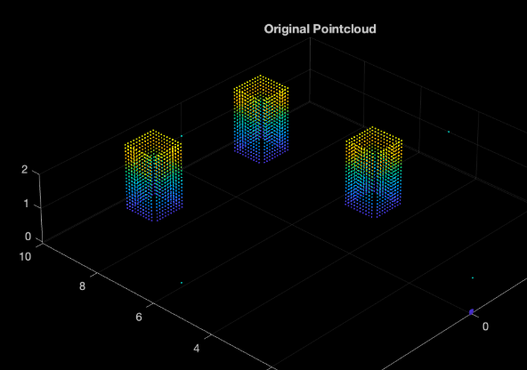
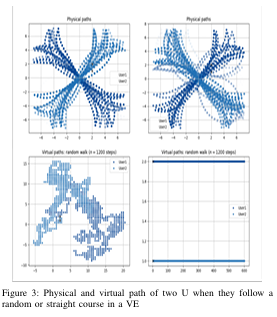
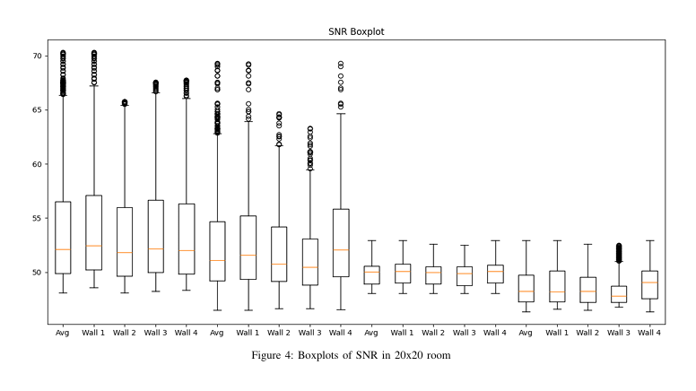

# mmWave Radar and IRS Simulation for Virtual Environments

## Project Overview

This repository contains a comprehensive MATLAB simulator designed for millimeter wave (mmWave) radar and Intelligent Reflecting Surfaces (IRS) to enhance sensing and coverage in virtual environments. The simulator addresses critical challenges in full-immersive multiuser virtual reality (VR) experiences by optimizing signal homogeneity using strategically placed IRS units to reflect signals in constrained environments.

Our approach leverages advanced mmWave radar techniques to create high-resolution heatmaps, which are then processed using neural networks to accurately detect and track user positions in real-time, enabling seamless VR experiences with minimal latency.

## Key Features

- **mmWave Radar Simulation**: Accurate modeling of mmWave radar signals (77 GHz) for high-resolution sensing
- **Intelligent Reflecting Surface (IRS) Optimization**: Implementation of multiple IRS placement algorithms to enhance signal coverage
- **Neural Network-Based Positioning**: Deep learning approach for precise user location detection
- **Multi-User Tracking**: Support for simultaneous tracking of multiple users in constrained environments
- **Signal Homogeneity Evaluation**: Comprehensive PSNR metrics for comparing different IRS placement techniques
- **Virtual Environment Integration**: Simulation of both physical and virtual paths for redirected walking in VR

## Simulation Environment

Our simulation represents a room-scale VR environment where multiple users can be present simultaneously. Users are represented by bounding boxes for PSNR computation and coverage analysis:


*Fig. 1: Simulation environment showing 3 users represented as bounding boxes. Each user's position is tracked and used for PSNR computation and coverage analysis.*

## User Movement Simulation

The simulator tracks both the physical paths (actual user movement in the real world) and virtual paths (perceived movement in the VR environment), which is crucial for redirected walking techniques:


*Fig. 2: Visualization of both physical (solid lines) and virtual (dashed lines) paths that users follow in the VR environment. This demonstrates how redirected walking techniques can be used to optimize movement in constrained physical spaces while maintaining immersion.*

## Performance Comparison

We compare different IRS placement techniques to demonstrate the effectiveness of our approach:


*Fig. 3: PSNR comparison between different IRS placement strategies: No IRS (baseline), Random placement, Exhaustive search optimization, and our Optimal IRS placement algorithm. The graph demonstrates significant improvements in signal quality and homogeneity with our approach.*

## Algorithms Implemented

Our simulator implements and compares four different approaches:

1. **No IRS (Baseline)**: Only the signal directly from the Access Point (AP) is considered
2. **Random Placement**: IRS units are placed randomly on the walls
3. **Exhaustive Search**: A brute-force approach examining all possible IRS placements on walls
4. **Optimal Placement Algorithm**: Our novel approach that efficiently determines near-optimal IRS placement based on real-time user positions

The optimal algorithm shows significant improvements in signal homogeneity while maintaining computational efficiency compared to exhaustive search methods.

## Technical Details

The simulation uses:
- Frequency Modulated Continuous Wave (FMCW) signals for precise distance measurements
- 77 GHz operating frequency with 1.2 GHz bandwidth
- 4000-element IRS arrays for signal reflection
- Neural network architecture for processing radar heatmaps and determining user positions
- Advanced path loss modeling for accurate signal propagation simulation
- Multiple Access Point (AP) and IRS configurations for comparative analysis

## Research Foundation

This project extends and builds upon earlier work in high-resolution mmWave radar imaging:

```
@inproceedings{guan2020through,
  author = {Guan, Junfeng and Madani, Sohrab and Jog, Suraj and Gupta, Saurabh and Hassanieh, Haitham},
  title = {Through Fog High-Resolution Imaging Using Millimeter Wave Radar},
  booktitle = {IEEE/CVF Conference on Computer Vision and Pattern Recognition (CVPR)},
  month = {June},
  year = {2020}
}
```

## Published Research

Our research findings are published in:

```
@inbook{lemic2025location,
  authors = {Filip Lemic, Jalal Jalali, Gerard Calvo Bartra, Alejandro Amat, Jakob Struye, Jeroen Famaey, Xavier Costa Perez},
  title = {Location-based real-time utilization of reconfigurable intelligent surfaces for mmWave integrated communication and sensing in full-immersive multiuser Metaverse scenarios},
  booktitle = {IET Advanced Metaverse Wireless Communication Systems},
  pages = {101-136},
  year = {2025}
}
```

## Applications

This simulator is valuable for various applications:
- Full-immersive VR environment design and optimization
- mmWave-based user tracking and motion capture
- Signal coverage planning for VR installations
- Multi-user VR experience design
- Redirected walking algorithm development and testing
- Real-time 3D user pose estimation

## Future Work

Ongoing and planned enhancements include:
- Integration with real-time VR platforms
- Support for more complex environments and obstacles
- Advanced neural network architectures for improved tracking accuracy
- Extended evaluation in multi-room environments
- Implementation of dynamic IRS elements for adaptable environments
- Development of real-time optimization algorithms with reduced computational complexity
